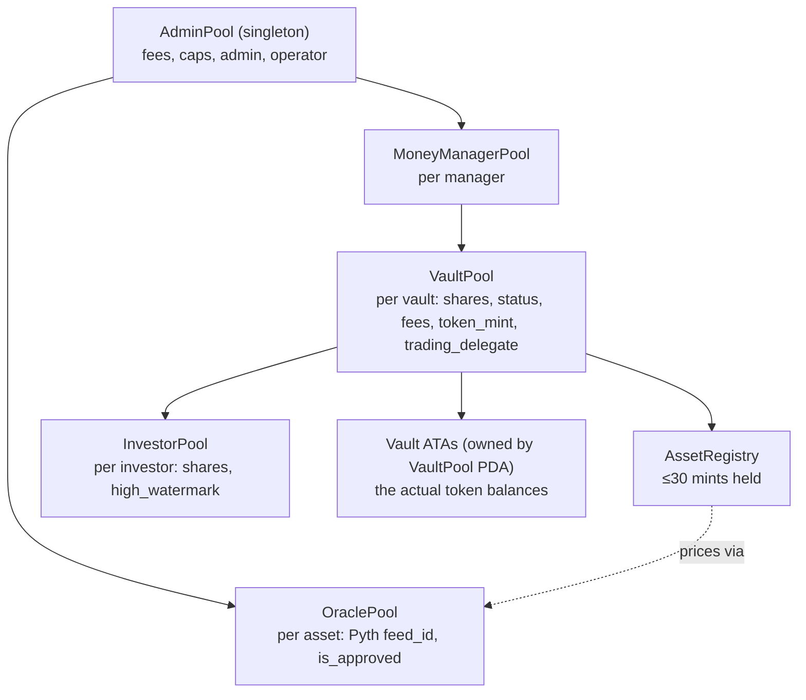
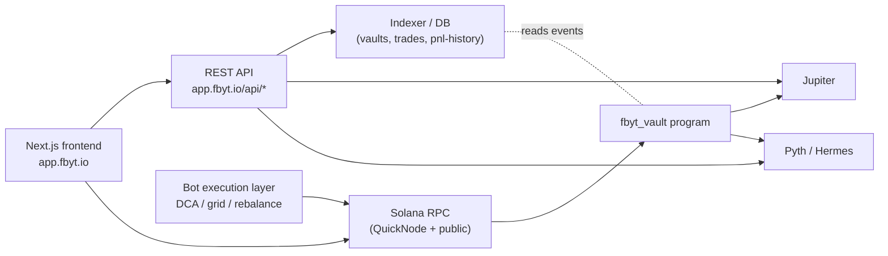

# FBYT — Architecture & PDA Model

Program: `DNgg2FmwchUHYx2QiZ9pNJn1q5zypMprkSWFLUnNDigm` (Anchor `fbyt_vault` v0.1.0).
All diagrams below are derived from the recovered IDL ([`fbyt_vault.idl.json`](./fbyt_vault.idl.json)).

---

## 1. Account / PDA tree

Every state account is a **program-owned PDA**. Seeds (byte arrays in the IDL decoded to strings):

| Account | Seeds | Cardinality |
|---------|-------|-------------|
| `AdminPool` | `["AdminPool"]` | **singleton** (global protocol config) |
| `MoneyManagerPool` | `["MoneyManagerPool", admin_pool, money_manager]` | one per manager |
| `VaultPool` | `["VaultPool", admin_pool, money_manager, mm_pool.vaults_amount]` | one per vault (index) |
| `AssetRegistry` | `["AssetRegistry", vault_pool]` | one per vault |
| `InvestorPool` | `["InvestorPool", investor, admin_pool, vault_pool, token_mint]` | one per (investor, vault) |
| `OraclePool` | `["oracle_pool", admin_pool, token_mint]` | one per approved asset |

Token custody: vault assets sit in **ATAs owned by the `VaultPool` PDA**
(`ata(vault_pool, token_program, mint)`), and the PDA signs transfers via its seeds.



## 2. State structs (key fields, from IDL)

**`VaultPool`** — `index, admin_pool, money_manager, token_mint, asset_registry, vault_pool_status,
investor_count, raised_amount_usd, total_shares, min_contribute_amount_usd, raise_period,
min_raise_amount_usd, mm_withdraw_period, withdraw_cooldown, last_trade_at, last_mm_fee_withdraw_at,
money_management_yearly_fee (bps), performance_fee (bps), is_open_ended, trading_delegate (pubkey)`

> Note in the IDL: `trading_delegate` was carved out of the head of `padding` so existing vaults
> need no realloc; all-zeros pubkey is the "no delegate" sentinel (deliberately not `Option<Pubkey>`
> to avoid shifting fields).

**`InvestorPool`** — `investor, admin_pool, vault_pool, token_mint, shares, hight_watermark[sic],
created_at, updated_at`

**`AssetRegistry`** — `vault_pool, asset_mints: Vec<pubkey>` (≤ `max_asset_count`)

**`OraclePool`** — `admin_pool, token_mint, feed_id: [u8;66], is_approved: bool`

**`AdminPool`** — `admin, pending_admin, operator, vault_pool_count, creation_fee,
protocol_performance_fee, protocol_money_management_fee, money_management_yearly_fee_max,
performance_fee_max, trading_fee, withdraw_cooldown_max, fundrising_period_max, raise_amount_min_usd,
contribution_amount_min_usd, oracle_max_age, idle_period, dust_threshold_usd, max_asset_count,
max_slippage_bps`

## 3. Instruction map (30 total)

| Group | Instructions |
|-------|--------------|
| Protocol admin (13) | `create_admin_pool`, `admin_modify_fee`, `admin_transfer_ownership`, `admin_accept_ownership`, `admin_update_operator`, `admin_update_{contribution_amount_min_usd,dust_threshold_usd,fundrising_period_max,idle_period,max_asset_count,max_slippage_bps,oracle_max_age,raise_amount_min_usd,withdraw_cooldown_max}` |
| Oracle | `create_oracle_pool`, `approve_oracle_pool`, `update_oracle_pool`, `close_oracle_pool`, `get_price_info` |
| Manager lifecycle | `create_money_manager_pool`, `create_vault`, `close_vault` |
| Investor | `create_investor_pool`, `deposit_token_fund`, `withdraw_token_fund` |
| Trading | `swap` (Jupiter CPI), `set_trading_delegate`, `revoke_trading_delegate` |
| Fees | `withdraw_money_management_fee` (operator-signed) |

> The recovered IDL also lists a `dummy_swap` (a direct vault↔manager transfer), but the deployed
> program does not dispatch it — see SECURITY.md #1. It is omitted here as it is not a live instruction.

## 4. Signer / authority matrix

| Instruction | Required signer(s) | PDA that signs for token moves |
|-------------|--------------------|-------------------------------|
| `create_vault` | `money_manager` | — |
| `deposit_token_fund` | `investor` | investor ATA → vault ATA |
| `withdraw_token_fund` | `investor` | vault ATA → investor (pro-rata basket) |
| `swap` | `trader` (== `money_manager` **or** `trading_delegate`) | vault input/output ATAs |
| `set_trading_delegate` / `revoke_trading_delegate` | `money_manager` | — |
| `withdraw_money_management_fee` | `operator` | vault ATA → fee dest |
| `admin_*` | `admin` (2-step transfer for ownership) | — |

## 5. Deposit flow

```mermaid
sequenceDiagram
    participant I as Investor wallet
    participant P as fbyt_vault program
    participant O as Pyth OraclePool
    participant V as Vault ATA (PDA-owned)
    I->>P: deposit_token_fund(amount)
    P->>O: read PriceUpdateV2 (value deposit in USD)
    P->>V: transfer amount from investor ATA -> vault ATA
    P->>P: shares = total_shares * usd / vault_AUM (first deposit sets price)
    P-->>I: InvestorPool.shares += shares ; emit DepositTokenFundEvent
```

## 6. Trade flow (Jupiter)

```mermaid
sequenceDiagram
    participant M as Manager / bot (trader)
    participant B as FBYT backend
    participant P as fbyt_vault program
    participant J as Jupiter program
    participant O as Pyth (in+out feeds)
    M->>B: request route (/api/jupiter/quote, /swap-instructions)
    B-->>M: serialized Jupiter ix (data: bytes)
    M->>P: swap(data)
    P->>O: read input & output prices
    P->>J: CPI swap (vault ATAs signed by VaultPool PDA)
    J-->>P: output tokens into vault output ATA
    P->>P: enforce slippage <= max_slippage_bps ; update AssetRegistry
    P-->>M: emit TradingEvent ; charge trading_fee (SOL)
```

## 7. Withdraw flow

```mermaid
sequenceDiagram
    participant I as Investor
    participant P as fbyt_vault program
    participant V as Vault ATAs
    I->>P: withdraw_token_fund(shares)
    P->>P: check withdraw_cooldown elapsed ; apply high-watermark perf fee
    loop each mint in AssetRegistry
        P->>V: transfer pro-rata slice -> investor ATA
    end
    P-->>I: burn shares ; emit WithdrawTokenFundResultEvent
```

## 8. System context


